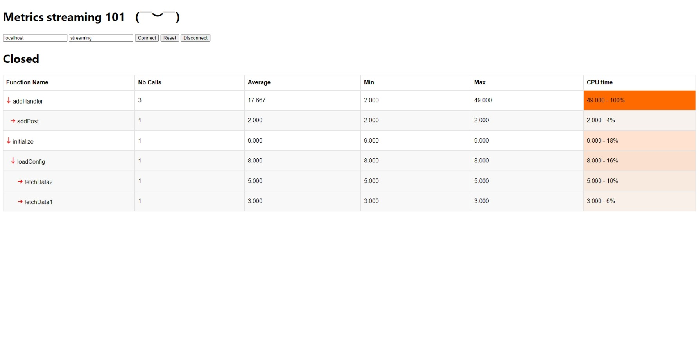

# Web interface to visualize performance metrics
## What is this exactly?
This is a web interface that computes and displays some metrics. Specifically made to display how long a function call took in milli-seconds on average, number of calls, mininum, maximum and how long it occupied the cpu (taking into consideration functions that are running in parallel). These metrics are all stored in the client side with close to zero impact on the server.

## Why not use Grafana for displaying and Prometheus for collecting the metrics?
They do a wonderful job at harvesting and displaying performance metrics. However, when it comes to micro profiling they lack a bit. For instance, we had to use buckets which decreases the precision of the measurement and can take quite a bit of time to set up. 

Grafana and Prometheus are primarely used for monitoring and not profiling. Meaning, they excel at collecting and displaying lots data continuously.

## How does this work?
The client establishes an event source request to an API that should stream json objects of this form 
```
{
    "id": "functionName",
    "parent": null,
    "start_end_times": [1000000, 6 * 1000000]
},
```

- id field: can hold any String, preferably the function name you are measuring.
- parent fied: should be set to null if this is the first function call that is called, else it should hold the parent function name so the client side could display the measurements in form of hierarchy.
- start_end_times: Array of 2 Ints. Contains, A. when the function started running and B. when it ended.



## Server code
For now I have only used this tool when working on a project made with Scala. Please check `server` folder and follow along.